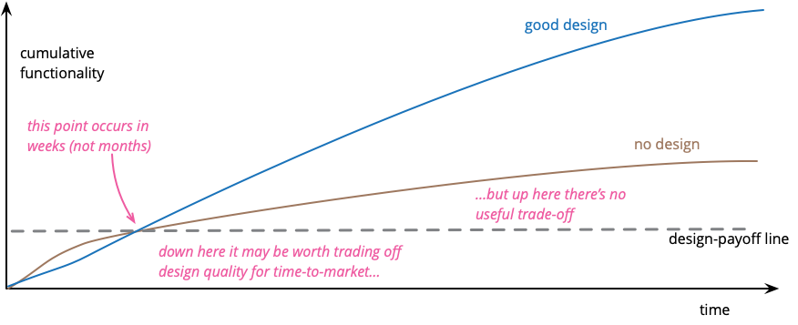
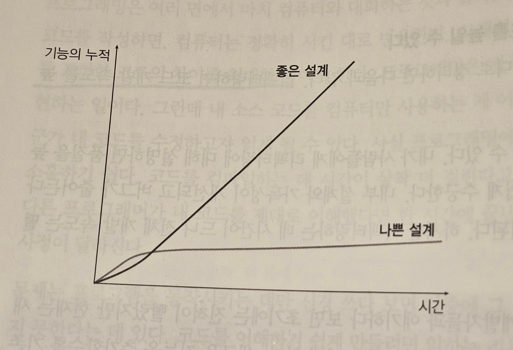

## 리팩토링 정의

- 겉보기 동작은 유지하면서 코드를 이해하고 수정하기 쉽도록 수정
  - 겉보기 동작 (observable behavior) 이 같다는 것은 외부에서 봤을 때 코드가 동일하게 동작한다는 뜻
    - 버그도 그대로 남는다

## 리팩토링은 작은 변화의 연속

- 작은 단계를 거쳐 코드를 수정하고 이 변화를 연결하여 큰 변화를 만들어낸다.
- 코드가 항상 정상 작동하기 때문에 언제든 멈출 수 있다.

## 리팩토링할 땐 리팩토링만 한다

- 기능 추가나 성능 최적화 같은 작업은 잠시 미뤄두고 리팩토링 시에는 리팩토링만 한다.

## 리팩토링의 이유

- 규칙적인 리팩토링을 수행하면, 설계가 개선된다
- 리팩토링을 거치면서 코드는 보통 짧아진다
  - 더 짧은 코드는 일반적으로 더 이해하기 쉽고 수정하기 쉽다
- 의도가 드러나 코드가 더 읽기 쉽다
- 버그를 찾기 쉬워진다
  - 구조가 명확하면 버그가 쉽게 보인다
- 시간이 지날수록 생산성이 올라간다
  - 모듈화가 잘 됐다면 소스코드의 일부만 이해하고 기능을 추가할 수 있다
  - Design Stamina Hypothesis

## 언제 리팩토링?

- 약 1시간 간격
- 비슷한 일을 3번 만나게 되면 리팩토링한다
- 기능을 새로 추가하기 직전에 리팩토링한다
  - 준비를 위한 리팩토링 (드라이브 전 자동차의 창문 닦기)
- 코드 분석 중 이해가 되지 않는다면 리팩토링한다
- 더러운 게 보이면 리팩토링한다
  - 간단한 것은 즉시 고치고, 오래걸릴 것 같다면 일단 메모만 해둔다
- 일반적으로 수시로 한다
  - 계획적으로 하는 것도 나쁘진 않은데, 구체적으로 목표를 정하고 짧게 수행

## 코드 리뷰

- 작성자와 함께 리뷰하고 리팩토링하면 좋다
  - 자연스러운 페어 프로그래밍이 됨

## 관리자에게

- 관리자의 기술역량이 부족하면 굳이 리팩토링한다고 말 할 필요는 없다
- 제한시간 내에 기능을 구현하는 방법으로 리팩토링을 사용하면 된다

## 리팩토링하지 않는 경우

- 외부 API 로만 이용하고 내부 동작을 이해할 필요가 없을 때
- 새로 작성하는 것이 더 빠를 때

## 리팩토링 시 고려할 문제

- 코드 소유권이 분산되어 있을 때
  - 코드를 사용하는 다양한 클라이언트가 있으므로 기존 함수를 그대로 동작시킬 수 있는 방향으로 리팩토링을 진행한다.
  - 코드의 소유권은 팀에 둬서 팀원이면 누구든 수정할 수 있게 하는 것이 좋다

## 브랜치

- 마스터와 통합 주기를 짧게 가져가는 것이 좋다 (약 하루 한번)

## 테스팅

- 대부분 Self-testing code 를 마련해야 한다.
  - 코드 자체가 자신을 테스트하는 로직 포함
  - 자동화된 방식으로 실행됨

## 레거시

- 테스트할 틈을 찾아서 시스템을 테스트하기
- 틈새를 만드는데 리팩토링이 활용됨
- 처음엔 테스트가 없으므로 어느정도의 위험을 감수할 수 밖에 없다

## 데이터베이스

- 진화형 데이터베이스 설계
- 단계를 잘게 쪼개기
- 변경을 되돌리기 쉽게 작업한다
- 필드만 추가 -> 새 필드를 사용하는 버전으로 교체 -> 예전 필드 삭제

## 리팩터링 아키텍처

- 요구사항이 변화되는 소프트웨어에서 이에 대응하도록 코드베이스를 잘 설계해줌
- 단, 리팩토링을 미루면 훨씬 힘들어진다는 확신이 들 때만 유연성 매커니즘을 미리 추가
  - YAGNI
  - 나중에 문제를 더 깊이 이해했을 때 처리하는 게 나은 경우가 있다

## 지속적 배포

- 소프트웨어를 언제든 릴리즈할 수 있는 상태로 유지
  - 하루에도 여러차례 배포가 가능하다

## 리팩터링과 성능

- 리팩토링으로 먼저 이해하기 쉬운 코드를 구성한 상태에서 성능 개선의 시간을 별도로 마련하는 게 좋다
- 시간 예산 분배(time budgeting): 정해진 시간과 목표를 두고 성능개선
- 끊임없는 관심을 기울이기: 보통 특정한 동작에만 관여하고 컴파일러와 런타임의 하드웨어 동작을 제대로 이해하지 못한 채 작성하는 경우가 많다

## 성능 개선의 비밀

- 먼저 측정하기
